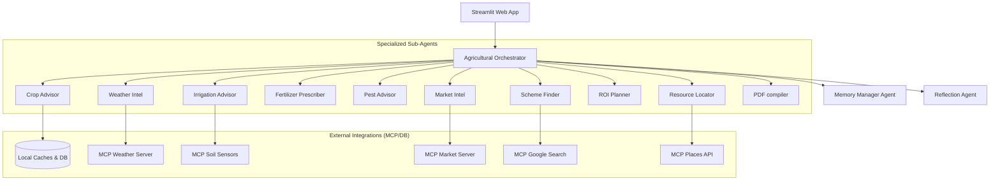
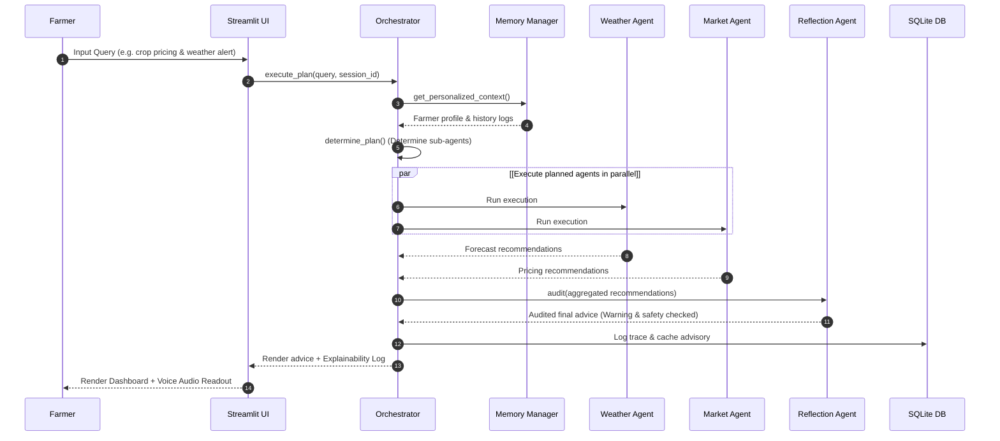
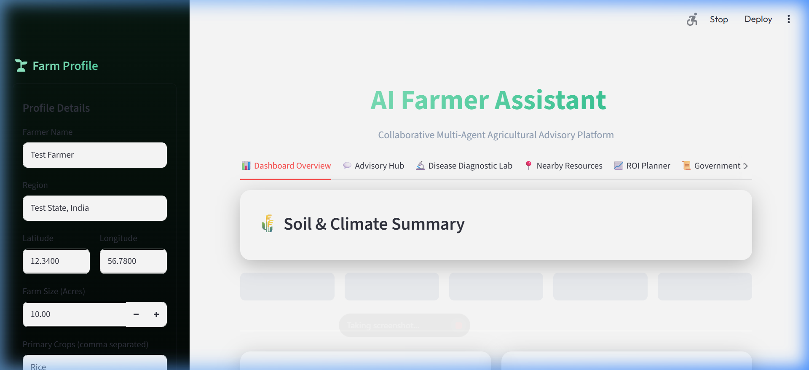

# AI Farmer Assistant

A production-grade, collaborative multi-agent agricultural platform built on Google's **Agent Development Kit (ADK)**, **Gemini 2.5 Pro**, **Gemini Vision**, and **Streamlit**.

---

## Architecture Diagram



---

## Sequential Flow Diagram



---

## Project Structure

```text
├── assets/
│   └── style.css            # Custom CSS for premium glassmorphism dark theme
├── agents/
│   ├── base_agent.py        # Custom BaseFarmerAgent wrapping Google ADK Agent
│   ├── crop_agent.py        # Seed selection and crop rotation planner
│   ├── disease_agent.py     # Crop leaf disease diagnostic agent (Gemini Vision)
│   ├── weather_agent.py     # Meteorological alerts and risk assessment
│   ├── irrigation_agent.py  # Watering recommendations and moisture telemetry
│   ├── fertilizer_agent.py  # N-P-K nutrient prescription builder
│   ├── pest_agent.py        # Integrated Pest Management (IPM) advisor
│   ├── market_agent.py      # Mandi price trends and store recommendations
│   ├── gov_scheme_agent.py  # Subsidy search and policy support browser
│   ├── financial_agent.py   # Crop budgets, expense tracking, and ROI charts
│   ├── resource_agent.py    # GIS places finder for seed stores and cold storages
│   ├── report_agent.py      # ReportLab PDF compile agent
│   ├── reflection_agent.py  # Advisory quality audit and contradiction checker
│   └── memory_agent.py      # Personalization context injector
├── tools/
│   ├── mcp_clients.py       # API clients for weather, mandi price, maps with caching
│   └── pdf_generator.py     # PDF Report compiler layout
├── tests/
│   └── test_components.py   # Pytest unit and integration test suite
├── app.py                   # Primary Streamlit visual dashboard
├── config.py                # Pydantic configuration & secret variables loader
├── database.py              # SQLite models, repositories, and caches
├── exceptions.py            # Domain-specific custom Exception definitions
├── logger.py                # Structured console logging formatter
├── memory.py                # History management and Digital Farmer Profile service
├── requirements.txt         # Package dependencies
├── Dockerfile               # Production container compiler
├── docker-compose.yml       # Local container cluster builder
└── README.md                # Comprehensive documentation
```

---

## Setup Guide

### 1. Requirements
Ensure you have **Python 3.11+** installed.

### 2. Installation
Clone this repository and run:
```bash
pip install -r requirements.txt
```

### 3. Environment Config
Create a `.env` file in the root directory (based on `.env.example`) and fill in your Gemini API key:
```env
GEMINI_API_KEY=AIzaSy...
```
*(If no key is supplied, the application automatically runs in **high-fidelity Mock mode** so you can view all functionalities and layout demonstrations immediately)*.

### 4. Running the Application
To run the visual Streamlit dashboard:
```bash
streamlit run app.py
```

### 5. Running Tests
To run the automated test suite:
```bash
pytest tests/
```

---

## Troubleshooting Guide

- **Error: `Gemini API key is invalid`**
  - Check that your `.env` contains `GEMINI_API_KEY=your_key` with no quotes or spaces.
- **Error: `PDF generation fails`**
  - ReportLab requires write access to the `scratch/` folder. Ensure the local workspace has directory permissions.
- **Slow Dashboard Loading**
  - The application automatically caches weather for 1 hour and market prices for 4 hours inside the local `farming.db` SQLite database. Clear `farming.db` to purge local state.

---

## 📺 Visual Dashboard Demo & Gallery

Below are the screenshots and video logs demonstrating the visual layout and operations of the AI Farmer Assistant app:

### 1. Dashboard Interface


### 2. Multi-Agent Conversation & Visual Diagnostics Demo


